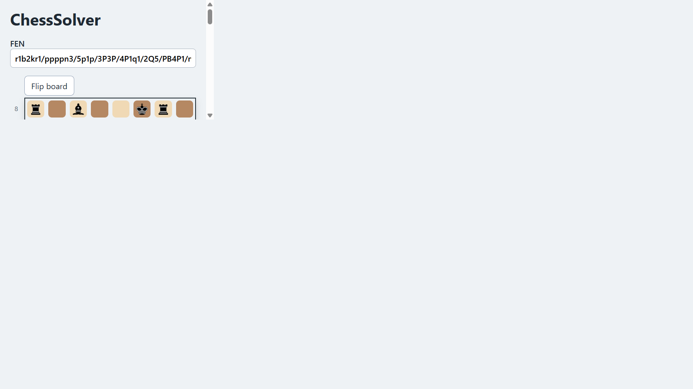
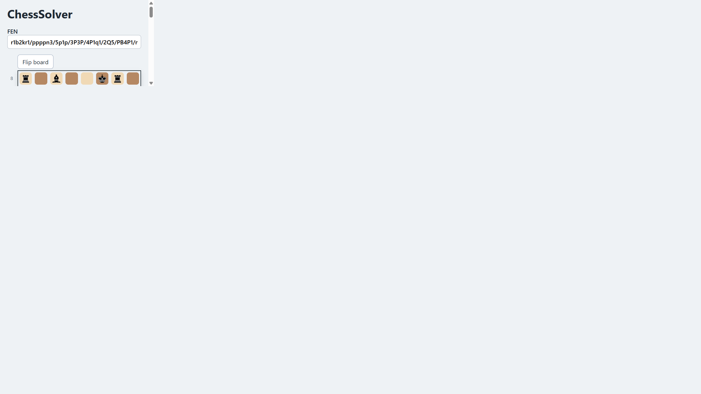

# ChessSolver

ChessSolver is a mate-in-N solver. The chess engine is C++17 and is compiled
to WebAssembly for a plain JavaScript web application. It searches whether the
side to move can force checkmate within N of its own moves, and displays a
longest-defence mating line.

## Layout

- `engine/` - the C++17 engine, legal move generation, validation, perft, and
  mate solver.
- `cli/` - the `chess_cli` command-line interface.
- `web/` - framework-free ES modules, worker, HTML, CSS, favicon, and the
  runtime piece images in `web/assets/`.
- `tests/` - CTest/doctest tests, JavaScript tests, WASM tests, and the
  checked-in Lichess fixture corpus.
- `scripts/` - WASM and Stockfish comparison helpers.
- `docs/` - testing, benchmark, limitation, and specification documents.

`web/assets/` is the single source of truth for the images used by the static
web app. The former duplicate root `assets/` directory was removed.

## Native build and tests

### Windows PowerShell with MinGW

Install CMake, MinGW-w64 (`g++`), Python 3, and Node.js first. Make sure
CMake and MinGW-w64 (`g++`) are on `PATH`:

```powershell
cmake --preset windows
cmake --build --preset windows -j
ctest --preset windows
```

### Linux

```bash
cmake --preset linux
cmake --build --preset linux -j
ctest --preset linux
```

Use `windows-debug` or `linux-debug` in place of the preset name for a Debug
build. As an alternative, the manual commands remain available:
`cmake -S . -B build -G "MinGW Makefiles" -DCMAKE_BUILD_TYPE=Release`,
`cmake --build build`, and `ctest --test-dir build --output-on-failure`
(use `-G "Unix Makefiles"` on Linux).

## CLI

Quote FEN strings because they contain spaces.

```powershell
.\build_release\cli\chess_cli.exe solve `
  "6rk/p6p/1p2Qpr1/8/3PRP2/q5P1/7P/4R1K1 b - - 0 27" 3

.\build_release\cli\chess_cli.exe bench
.\build_release\cli\chess_cli.exe perft "<fen>" 4
.\build_release\cli\chess_cli.exe divide "<fen>" 3
```

The POSIX executable names are the same without `.exe`, for example
`./build_release/cli/chess_cli solve "<fen>" 3`.

`divide` prints one UCI root move and its subtree count per line, such as
`e2e4: 600`.

## WASM build and web app

The WASM build uses Emscripten. On Windows, run the emsdk environment setup in
the same PowerShell session as the build:

```powershell
& "$env:USERPROFILE\emsdk\emsdk_env.ps1"
.\scripts\build_wasm.ps1
$env:CHESS_WASM_MODULE = (Resolve-Path .\web\chess_engine.js).Path
node --test .\tests\wasm_test.mjs
python -m http.server 8000 --directory web
```

On Linux:

```bash
source "$HOME/emsdk/emsdk_env.sh"
emcmake cmake -S . -B build_wasm -DCMAKE_BUILD_TYPE=Release
cmake --build build_wasm --target chess_engine_wasm -j
cp build_wasm/engine/chess_engine.js web/chess_engine.js
cp build_wasm/engine/chess_engine.wasm web/chess_engine.wasm
CHESS_WASM_MODULE="$PWD/web/chess_engine.js" node --test tests/wasm_test.mjs
python3 -m http.server 8000 --directory web
```

Open `http://127.0.0.1:8000/`. A static server is required; opening
`index.html` directly is not supported.

Generated `web/chess_engine.js` and `web/chess_engine.wasm` are ignored by Git.

## Stockfish comparison

Install Stockfish and make its executable available on `PATH`, or pass its
absolute path:

```powershell
python .\scripts\compare_solver_stockfish.py `
  --chess-cli .\build_release\cli\chess_cli.exe `
  --stockfish "$env:USERPROFILE\AppData\Local\Microsoft\WinGet\Links\stockfish.exe"
```

The positive mode compares the 85 rows in
`tests/data/lichess_mate_puzzles.tsv`. The standalone
`tests/data/stalemate_avoidance.tsv` can be compared separately:

```powershell
python .\scripts\compare_solver_stockfish.py `
  --chess-cli .\build_release\cli\chess_cli.exe `
  --stockfish stockfish.exe `
  --data .\tests\data\stalemate_avoidance.tsv
```

Negative mode asks for N-1 and skips mate-in-1:

```powershell
python .\scripts\compare_solver_stockfish.py `
  --chess-cli .\build_release\cli\chess_cli.exe `
  --stockfish stockfish.exe `
  --negative
```

The checked-in corpus currently has 55 eligible rows (30 mate-in-2,
20 mate-in-3, and 5 mate-in-4). A Stockfish mate longer than the requested
N-1 is not a disagreement.

## Verify in a clean Linux environment (Docker)

This optional check builds the project in Docker and runs the Stockfish
comparison in the clean image:

```bash
docker build -t chesssolver-test .
docker run --rm chesssolver-test python3 scripts/compare_solver_stockfish.py --chess-cli ./build/cli/chess_cli --stockfish /usr/games/stockfish
```

## Limits and cancellation

- `MAX_N` is 5.
- The C wrapper uses a default 30-second time limit.
- A timeout is reported as `TimedOut`, never as `NoMateWithinN`.
- Cancel terminates the worker and creates a fresh worker; it does not pretend
  that an interrupted search proved no mate.
- The solver is single-threaded.

## Screenshots

The screenshots below were captured from the Chromium browser verification
session at `1366x768` and `1920x1080`.




